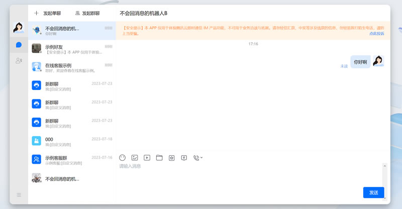

# qcloudim介绍

 《qcloudim》是基于腾讯云即时通信 IM-SDK开发的一套，完善可用经过大量项目测试的SAAS系统，安装好后直接填写自己的密钥即可使用。

   本系统完全开源，开发者可以进行自己的二次开发，在有客服聊天的项目场景中使用。 支持WEB，H5，APP安卓，APP苹果，小程序，桌面客户端等你想使用的地方。

### 使用方法

  通过在后台创建一个客服获取到链接直接复制到需要加载客服的地方。

### 开源版（OpenSource）和开源Pro（OpenSourcePro）版本区别

- OpenSource开源版：
  
  - 麻雀虽小五脏俱全！
  - 支持二次开发，不提供任何技术支持！

- OpenSourcePro开源版：
  
  - 提供技术开发指导，联系作者： tcloud666
  - 如果需要开发版本可以加星免费申请开发者账号
  
  

> 所有可用主要功能依赖于腾讯云即时通信 IM版本功能区请查看下表

> 如果对你有帮助，别吝啬你的小手留个star呗

# 腾讯云即时通讯IM

直接使用腾讯云即时通讯IM功能就，填写自己的密钥就可以SaaS部署使用的完整客服系统

## 功能对比

| **功能点**               | **体验版**                    | **开发版**                     | **专业版**                    | **旗舰版**                     |
| --------------------- | -------------------------- | --------------------------- | -------------------------- | --------------------------- |
| 全球多点覆盖                | 支持                         | 支持                          | 支持                         | 支持                          |
| 用户数上限                 | 100人                       | 100人                        | 无限制                        | 无限制                         |
| 单个用户好友人数上限            | 20个好友                      | 20个好友                       | 3000个好友                    | 3000个好友                     |
| 单个用户可加入群组数            | 50个群/人                     | 50个群/人                      | 500个群/人                    | 1000个群/人                    |
| 单个群成员数上限（非直播群）        | 20人/群                      | 20人/群                       | 200人/群                     | 2000人/群                     |
| 群组数上限（解散后不计数）         | 100个                       | 100个                        | 无限制                        | 无限制                         |
| 可创建直播群（AvChatRoom）个数  | 10个                        | 10个                         | 50个                        | 无限制                         |
| 日净增群组数                | 100个                       | 100个                        | 10000个                     | 10000个                      |
| 免费历史消息存储时长            | 7天                         | 7天                          | 7天                         | 30天                         |
| 免费峰值日活跃用户数（峰值DAU）     | 100                        | 100                         | 10000                      | 10000                       |
| 免费峰值群组数               | 100个/月                     | 100个/月                      | 100000个/月                  | 100000个/月                   |
| 云端会话列表拉取个数            | 100个                       | 100个                        | 100个                       | 500个                        |
| 全员推送                  | 不支持                        | 支持，需在控制台开通。详情请参见 全员推送设置     | 不支持                        | 支持，需在控制台开通。详情请参见 全员推送设置     |
| 同平台多设备在线              | 不支持                        | 支持                          | 不支持                        | 支持                          |
| 本地消息搜索（Android、iOS）   | 不支持                        | 支持                          | 不支持                        | 支持                          |
| 直播群新成员查看入群前消息         | 不支持                        | 支持                          | 不支持                        | 支持                          |
| 创建社群（Community）       | 不支持                        | 可容纳10万人，需在控制台开通。详情请参见 群功能配置 | 不支持                        | 可容纳10万人，需在控制台开通。详情请参见 群功能配置 |
| 消息已读回执                | 不支持                        | 支持                          | 不支持                        | 支持                          |
| 群定向消息                 | 不支持                        | 支持                          | 不支持                        | 支持                          |
| 直播群在线成员列表             | 不支持                        | 支持                          | 不支持                        | 支持                          |
| 直播群广播消息               | 不支持                        | 支持                          | 不支持                        | 支持                          |
| 用户状态                  | 不支持                        | 支持                          | 不支持                        | 支持                          |
| 会话标记                  | 不支持                        |                             |                            |                             |
| 可开通会话标记插件含UI无缝集成      | 支持无UI集成开通会话标记插件后可支持含UI无缝集成 | 不支持可开通会话标记插件含UI无缝集成         | 支持无UI集成开通会话标记插件后可支持含UI无缝集成 |                             |
| 会话分组                  | 不支持可开通会话分组插件含 UI 无缝集成      | 支持无UI集成                     |                            |                             |
| 开通会话分组插件后可支持含 UI 无缝集成 | 不支持                        |                             |                            |                             |
| 可开通会话分组插件含 UI 无缝集成    | 支持无UI集成                    |                             |                            |                             |
| 开通会话分组插件后可支持含 UI 无缝集成 |                            |                             |                            |                             |
| 直播群封禁成员               | 不支持                        | 支持                          | 不支持                        | 支持                          |
| 消息扩展                  | 不支持                        | 支持                          | 不支持                        | 支持                          |
| 本地审核                  | 可开通                        | 可免费体验50个词                   | 可开通                        | 可开通                         |
| 云端审核                  | 可开通                        | 可开通                         | 可开通                        | 可开通                         |
| 插件服务                  | 可开通                        | 可开通                         | 可开通                        | 可开通                         |

官方详细文! [即时通信 IM 计费概述-购买指南-文档中心-腾讯云](https://cloud.tencent.com/document/product/269/11673)

### 联系作者支持：

飞机群：[https://t.me/+cyY_nAvyYcJkMGRl](https://t.me/+cyY_nAvyYcJkMGRl)；
